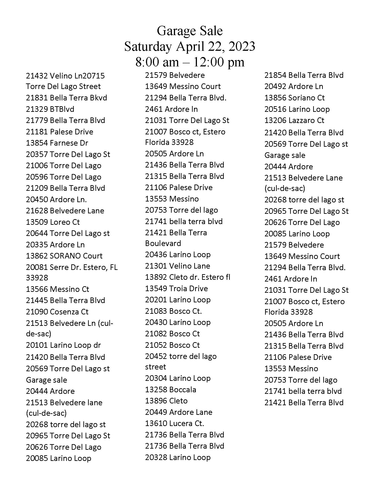
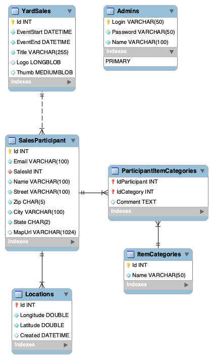

# Scenario for all sessions

In order to maximize the reusability of the examples, I will present one overarching example. Each session will stand on its own feet and you will not require to attend all three sessions in order to follow them individually.

However, all sessions share the same database model and idea.

## Practical example

When spending more time in the United States since 2010, I often noticed huge amounts of used goods in driveways and yards on the weekend when driving through neighborhoods. At first I wondered if there were regulations for people in these areas only to move moved out on certain days. Trash day was also an option, but the quality of the goods was sometimes impeccable. That's how I got introduced to the concept of a yard sale.


It is quite popular in the United States to organize yard sales or garage sales - the vocab depends on where you live exactly. In order to find out which neighbor wants to participate, organizers send out QR codes. Interested parties can then navigate to a web page using this QR code and provide their contact details to be included in the list of participants. They are also able to provide additional information which kind of items they are selling selecting certain categories. One week before the actual garage sale, the organizers prepare a report with a list of all the participants and email it to local newsletters. Further, they create a route to visit each and every participant during the event to provide a small gift for participating in a neighborhood event as well to make sure that the sold goods are in alignment with the spirit of the community. Finally, they provide this list to local law enforcement and other service providers in the area that they are aware of the garage sale.

Here's a recent example from my neighborhood. We got the QR code to sign up in an email:


A few days after that as we are signed up in a local text newsletter, we received a text on our phones:


A week before the event, the organizers sent out a list of all participants:



After watching my three sessions, you will be able to implement this example using Delphi and several tools from TMS!

## What's part of this example

Here are a few highlights of the things you will learn:

1. FlexCel:
  - Use FireDAC to access a MySQL database
  - Create a report of all participants with FlexCel
  - Provide the report as part of a web service
  - Locate and mark all participants on a map with custom icons
1. FNC Maps:
  - Locate all participants on a map (geocoding)
  - Create an optimal route to visit all participants
  - Create turn-by-turn instructions
1. TMS WEB Core and XData:
  - Create a web application that people can use to sign up
  - Create a web service backend to store and retrieve information for the sign up page
  - Responsive web design using Bootstrap 

## Database model

We cannot design and create the database model as part of a session as it is a requirement for all three sessions. Basically, I'd be spending half the time doing the same thing each session. That's a great fun, cozy time for me, but might get boring at some point if you are interested in more than one of my sessions.

The database model has been designed using a MySQL server. As version I used `8.0.32`. No specific database features are used that would prevent you from using any other relational database server of you choice.

{: .warning}
Do **not** use SQLite. As we are building a web service backend that will work in a multi-threaded environment, a file-based database management system is really not the way to go. As Wagner Landgraf will most likely tell you, it is certainly *possible* to use SQLite. However, it will require a deeper understanding of the inner mechanics that you can circumvent when starting with XData. 

The following SQL script will work fine with the MySQL version mentioned, but might need some adjustments for earlier versions. 

### Tables in detail

Here are just some important facts about the database structure that are essential to make things work the way they are supposed to. 

- The model below designates each primary key with a yellow key icon. 
- If the key icons are orange that means that the primary key composites also are part of a foreign key constraint (`ParticipantItemCategories`).
- Diamonds designate attributes. They are either cyan an cannot be `NULL` or have a white fill which indicates that these fields can be `NULL`. Orange colored attributes are part of a foreign key constraint.
- Tables that have are linked with a foreign key constraint are connected with lines.



During the sessions, I will only focus on the tables that are relevant for each session. Thus, the detailed purpose of each table will be given in their respective session.

The general understanding of the model is as follows:

- `YardSales` contains all the garage or yard sales. In addition to a logo, a thumbnail will be stored as well. The thumbnail will be generated by the web service if it does not exist yet.
- `SalesParticipant` embodies all the participant of a yard sale. The yard sale is identified using `SalesId` which also serves as a foreign key. Each participant can be identified by their `Id` which is unique in the whole database. That means the model requires participants to sign up for each yard sale individually. This model does not create participants that can sign up for one or multiple yard sales.
- `ItemCategories` names categories by `Name` that identify what participants want to sell. 
- `ParticipantItemCategories` is a cross-table used to list all the item categories a participant offers for sale. 
- `Locations` adds geographical information to a participant. Each record's `Id` is equal to the `Id` of the participant it belongs to.
- `Admins` serves as a very simplified tables to store login information for organizers (admins). Some operations in the web service are only available if you authenticate as an organizer. Participants should not be able to create a report or remove participants, for example.

### SQL to create the model

```sql
-- --------------------------------------------------------
-- Host:                         192.168.0.11
-- Server version:               8.0.32 - Homebrew
-- Server OS:                    macos13.0
-- HeidiSQL Version:             12.4.0.6659
-- --------------------------------------------------------

/*!40101 SET @OLD_CHARACTER_SET_CLIENT=@@CHARACTER_SET_CLIENT */;
/*!40101 SET NAMES utf8 */;
/*!50503 SET NAMES utf8mb4 */;
/*!40103 SET @OLD_TIME_ZONE=@@TIME_ZONE */;
/*!40103 SET TIME_ZONE='+00:00' */;
/*!40014 SET @OLD_FOREIGN_KEY_CHECKS=@@FOREIGN_KEY_CHECKS, FOREIGN_KEY_CHECKS=0 */;
/*!40101 SET @OLD_SQL_MODE=@@SQL_MODE, SQL_MODE='NO_AUTO_VALUE_ON_ZERO' */;
/*!40111 SET @OLD_SQL_NOTES=@@SQL_NOTES, SQL_NOTES=0 */;


-- Dumping database structure for yardsales
CREATE DATABASE IF NOT EXISTS `yardsales` /*!40100 DEFAULT CHARACTER SET utf8mb3 COLLATE utf8mb3_bin */ /*!80016 DEFAULT ENCRYPTION='N' */;
USE `yardsales`;

-- Dumping structure for table yardsales.Admins
CREATE TABLE IF NOT EXISTS `Admins` (
  `Login` varchar(50) COLLATE utf8mb3_bin NOT NULL,
  `Password` varchar(50) COLLATE utf8mb3_bin NOT NULL COMMENT 'not for production use!',
  `Name` varchar(100) COLLATE utf8mb3_bin NOT NULL,
  PRIMARY KEY (`Login`)
) ENGINE=InnoDB DEFAULT CHARSET=utf8mb3 COLLATE=utf8mb3_bin;

-- Data exporting was unselected.

-- Dumping structure for table yardsales.ItemCategories
CREATE TABLE IF NOT EXISTS `ItemCategories` (
  `Id` int unsigned NOT NULL AUTO_INCREMENT,
  `Name` varchar(50) COLLATE utf8mb3_bin NOT NULL,
  PRIMARY KEY (`Id`)
) ENGINE=InnoDB AUTO_INCREMENT=12 DEFAULT CHARSET=utf8mb3 COLLATE=utf8mb3_bin;

-- Data exporting was unselected.

-- Dumping structure for table yardsales.Locations
CREATE TABLE IF NOT EXISTS `Locations` (
  `Id` int unsigned NOT NULL,
  `Longitude` double NOT NULL DEFAULT '0',
  `Latitude` double NOT NULL DEFAULT '0',
  `Created` datetime DEFAULT NULL,
  PRIMARY KEY (`Id`),
  CONSTRAINT `FK_Locations_Participants` FOREIGN KEY (`Id`) REFERENCES `SalesParticipant` (`Id`) ON DELETE CASCADE
) ENGINE=InnoDB DEFAULT CHARSET=utf8mb3 COLLATE=utf8mb3_bin;

-- Data exporting was unselected.

-- Dumping structure for table yardsales.ParticipantItemCategories
CREATE TABLE IF NOT EXISTS `ParticipantItemCategories` (
  `IdParticipant` int unsigned NOT NULL,
  `IdCategory` int unsigned NOT NULL,
  `Comment` text CHARACTER SET utf8mb3 COLLATE utf8mb3_bin,
  PRIMARY KEY (`IdParticipant`,`IdCategory`),
  KEY `FK_Categories` (`IdCategory`),
  CONSTRAINT `FK_Categories` FOREIGN KEY (`IdCategory`) REFERENCES `ItemCategories` (`Id`),
  CONSTRAINT `FK_Participants` FOREIGN KEY (`IdParticipant`) REFERENCES `SalesParticipant` (`Id`) ON DELETE CASCADE
) ENGINE=InnoDB DEFAULT CHARSET=utf8mb3 COLLATE=utf8mb3_bin;

-- Data exporting was unselected.

-- Dumping structure for table yardsales.SalesParticipant
CREATE TABLE IF NOT EXISTS `SalesParticipant` (
  `Id` int unsigned NOT NULL AUTO_INCREMENT,
  `Email` varchar(100) COLLATE utf8mb3_bin NOT NULL,
  `SalesId` int unsigned NOT NULL,
  `Name` varchar(100) COLLATE utf8mb3_bin NOT NULL,
  `Street` varchar(100) COLLATE utf8mb3_bin NOT NULL,
  `Zip` char(5) COLLATE utf8mb3_bin NOT NULL DEFAULT '',
  `City` varchar(100) COLLATE utf8mb3_bin NOT NULL,
  `State` char(2) COLLATE utf8mb3_bin NOT NULL DEFAULT '',
  `MapUrl` varchar(1024) COLLATE utf8mb3_bin DEFAULT NULL,
  PRIMARY KEY (`Id`),
  KEY `FK_SALES` (`SalesId`),
  CONSTRAINT `FK_SALES` FOREIGN KEY (`SalesId`) REFERENCES `YardSales` (`Id`) ON DELETE CASCADE
) ENGINE=InnoDB AUTO_INCREMENT=14 DEFAULT CHARSET=utf8mb3 COLLATE=utf8mb3_bin;

-- Data exporting was unselected.

-- Dumping structure for table yardsales.YardSales
CREATE TABLE IF NOT EXISTS `YardSales` (
  `Id` int unsigned NOT NULL AUTO_INCREMENT,
  `EventStart` datetime NOT NULL,
  `EventEnd` datetime NOT NULL,
  `Title` varchar(255) COLLATE utf8mb3_bin NOT NULL DEFAULT '',
  `Logo` longblob,
  `Thumb` mediumblob,
  PRIMARY KEY (`Id`)
) ENGINE=InnoDB AUTO_INCREMENT=4 DEFAULT CHARSET=utf8mb3 COLLATE=utf8mb3_bin;

-- Data exporting was unselected.

/*!40103 SET TIME_ZONE=IFNULL(@OLD_TIME_ZONE, 'system') */;
/*!40101 SET SQL_MODE=IFNULL(@OLD_SQL_MODE, '') */;
/*!40014 SET FOREIGN_KEY_CHECKS=IFNULL(@OLD_FOREIGN_KEY_CHECKS, 1) */;
/*!40101 SET CHARACTER_SET_CLIENT=@OLD_CHARACTER_SET_CLIENT */;
/*!40111 SET SQL_NOTES=IFNULL(@OLD_SQL_NOTES, 1) */;
```