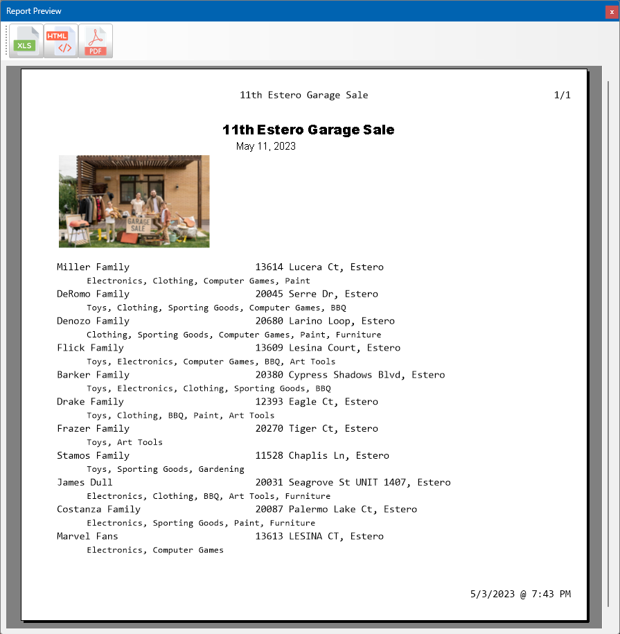

# TMS FlexCel: Reporting Everywhere

The session will explain how to create a database-driven report with preview. In order to provide reports to web clients, the report will be loosely coupled to the user interface and can thus be used inside of an XData server as well.



## Creating the template

The template will be completely created in Microsoft Excel. 

{: .note}
Obviously, you could generate the template document using FlexCel API as well. However, designing in Microsoft Excel is much easier.


- Information for the yard sale record is not linked to the dataset. Instead, two placeholders are defined which are filled with values at run-time on a field-by-field basis. The report iteration does not affect this:
  1. `#YardSaleTitle`: Title of the yard sale
  1. `#YardSaleEventDates`: Date and time of the event

- The logo of the yard sale - its thumbnail to be precise - will be loaded into the placeholder `#YardSaleThumb`.\


## Report Manager data module

The report manager hosts the operations to 
- retrieve the data from the database,
- load the report template, and
- create the report.

### Setting up the database connection

All database queries are hosted inside the data module without a `FDConnection` instance. At run-time a connection will be linked to each query passed by the main form view controller.

```pascal
constructor TReportManager.Create(AOwner: TComponent; AConnection: TFDConnection);
begin
  inherited Create( AOwner );

  FConnection := AConnection;
  Sale.Connection := FConnection;
  Participants.Connection := FConnection;
  ParticipantCategories.Connection := FConnection;
end;
```
The easiest way to do this is to provide a custom constructor. Hiding the default constructor, a connection `AConnection` now needs to be passed to the data module when created. That connection will then be stored in the field `FConnection`. Each query will also be linked to that connection.

### Retrieving data with queries

All queries are found on the designer canvas and make use of parameters. 

{: .warning}
**Always** use parameters. Never build your queries at run-time using strings.

1. `Sale`: Select the yard sale that to create the report for:
```sql
SELECT * FROM YardSales WHERE Id = :Id
```
2. `Participants`: Select all participants of that sale using `SalesId` as filter. 
```sql
SELECT * FROM SalesParticipant P  
    WHERE SalesId = :SalesId
```
3. `ParticipantCategories`: Define another query used as detail to a participant listing all their categories.
```sql
SELECT Id, Name FROM ParticipantItemCategories
    LEFT JOIN ItemCategories i ON i.Id = IdCategory
    WHERE IdParticipant = :Id 
```
This query will be managed by FireDAC. It will always list the categories of the participant that is selected in the query. The parameter `Id` will be filled through the `MasterSource` link.  The field is set as the only field in `MasterFields`.\
\
The data source `sourceParticipants` simply points to the dataset `Participants`.\


