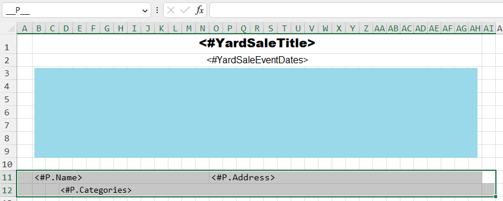
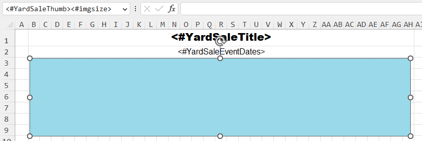

# Creating the template

The template will be completely created in Microsoft Excel. 

{: .note}
Obviously, you could generate the template document using FlexCel API as well. However, designing in Microsoft Excel is much easier.

- Information for the yard sale record is not linked to the dataset. Instead, two placeholders are defined which are filled with values at run-time on a field-by-field basis. The report iteration does not affect this:
  1. `#YardSaleTitle`: Title of the yard sale
  1. `#YardSaleEventDates`: Date and time of the event

- The logo of the yard sale - its thumbnail to be precise - will be loaded into the placeholder `#YardSaleThumb`.\

There is one remaining ingredient in the template. This is also the one that most Delphi developers struggle with. Microsoft Excel allows you to define *ranges* that are identified by names. These names are used by FlexCel (not Excel!) to determine the scope of placeholders you use in that range.

In the first screenshot of the template, notice the identifier `__P__`. This is the name of the selected range shown in the template. It encompasses all the placeholders that start with `#P.`. Further, the two underscores `__` mean that for each record inside of the dataset that is linked as `P`, this range will be inserted. Imagine you link this `P` to a `TDataSet` or `TList` that contains all the participants for your record. The placeholders inside of this range can then access all individual properties or fields of `P`. In this example, we insert `Name`, `Address`, and `Categories` into the report for each record. If you have a look at the database model, you might hesitate a bit. These fields do not exist. Well, the magic of Delphi allows us to define calculated fields that are calculated when needed. Thus, there is no restriction when using FlexCel what kind of field you want to use. As long as its value can be converted to `TValue`, you are good to go.

