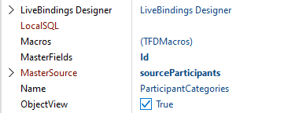
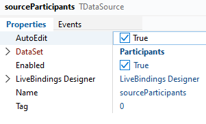

# Report Manager data module

The report manager hosts the operations to 
- retrieve the data from the database,
- load the report template, and
- create the report.

## Setting up the database connection

All database queries are hosted inside the data module without a `FDConnection` instance. At run-time a connection will be linked to each query passed by the main form view controller.

```pascal
constructor TReportManager.Create(AOwner: TComponent; AConnection: TFDConnection);
begin
  inherited Create( AOwner );

  FConnection := AConnection;
  Sale.Connection := FConnection;
  Participants.Connection := FConnection;
  ParticipantCategories.Connection := FConnection;
end;
```
The easiest way to do this is to provide a custom constructor. Hiding the default constructor, a connection `AConnection` now needs to be passed to the data module when created. That connection will then be stored in the field `FConnection`. Each query will also be linked to that connection.

## Retrieving data with queries

All queries are found on the designer canvas and make use of parameters. 

{: .warning}
**Always** use parameters. Never build your queries at run-time using strings.

1. `Sale`: Select the yard sale that to create the report for:
```sql
SELECT * FROM YardSales WHERE Id = :Id
```
2. `Participants`: Select all participants of that sale using `SalesId` as filter. 
```sql
SELECT * FROM SalesParticipant P  
    WHERE SalesId = :SalesId
```
3. `ParticipantCategories`: Define another query used as detail to a participant listing all their categories.
```sql
SELECT Id, Name FROM ParticipantItemCategories
    LEFT JOIN ItemCategories i ON i.Id = IdCategory
    WHERE IdParticipant = :Id 
```
This query will be managed by FireDAC. It will always list the categories of the participant that is selected in the query. The parameter `Id` will be filled through the `MasterSource` link.  The field is set as the only field in `MasterFields`.\
\
The data source `sourceParticipants` simply points to the dataset `Participants`.\


## Loading the template

The template will be stored inside of the executable as a resource. This removes all clutter from the application of files that have to be deployed with it. Everything is nicely included inside of the executable. Sadly, because we use MySQL we need to deploy that particular client library, but the library most likely can be found on most user's systems already. 

{: .note}
Some database client libraries can be statically linked into the executable with FireDAC. Other database frameworks do also might not require client libraries.

1. Add the resource file to the project and add the following content referencing your template file.
```
TEMPLATE_PARTICIPANTS RCDATA "..\Shared\Participants.xlsx"
```
Make sure that the encoding of the file is `ANSI`. Delphi is most likely set to `UTF-8` and the resource compiler does not support Unicode.
This will embed `..\Shared\Participants.xlsx` into the executable. The directory of your project file - not the project group - serves as origin for the absolute path.
1. Load the resource data into a stream.
  
    ```pascal
    procedure TReportManager.LoadTemplate(AName: String; ATemplate: TStream);
    var
      LResourceStream: TResourceStream;

    begin
      LResourceStream := TResourceStream.Create(
        HInstance, 'TEMPLATE_' + AName, RT_RCDATA );
      try
        LResourceStream.Position := 0;
        ATemplate.CopyFrom( LResourceStream );
        ATemplate.Position := 0;
      finally
        LResourceStream.Free;
      end;
    end;
    ```

    `TResourceStream` makes it easy load data from a resource. `HInstance` is available globally.
    Just make sure to move back the `Position` of the stream to `0` as FlexCel will not load it otherwise and throw an exception. 

## Adding calculated fields

Calculated fields are added to `Sale` and `Participants`.

### Sale

Date and time values are always tough. It would be possible to do these conversions in Microsoft Excel and thus also in FlexCel. However, why should we make our lives more difficult if we have the power of Delphi available?

The field `EventDates` will contain a string in the form of `May 11, 2023 (8:00 AM to 2:00 PM)`. 

```pascal
procedure TReportManager.SaleCalcFields(DataSet: TDataSet);
var
  LBuffer: String;
  LLocalStart,
  LLocalEnd : TDateTime;
begin
  LLocalStart :=
    TTimeZone.Local.ToLocalTime(
      DataSet.FieldByName('EventStart').AsDateTime
    );

  LLocalEnd :=
    TTimeZone.Local.ToLocalTime(
      DataSet.FieldByName('EventEnd').AsDateTime
    );

  LBuffer := FormatDateTime(
    'mmmm d, yyyy (t ', LLocalStart
     );
  LBuffer := LBuffer + FormatDateTime( 't)', LLocalEnd );

  DataSet.FieldByName('EventDates').AsString := LBuffer;
end;
```

The database contains all date and time values in universal time format. Delphi offers `TTimeZone` to convert UTC to local time easily. More to the point, you need to use the class property `Local` to access its functionality. After calculating the local times, we use `FormatDateTime` to create the text needed.

### Participants

We add two calculated fields to `Participants`. One field will be a concatenation of the address information named `Address` of type `String`. The second one will list all categories the participant selected.

```pascal
procedure TReportManager.ParticipantsCalcFields(DataSet: TDataSet);
var
  LBuffer: String;

begin
   // (1)
   Dataset.FieldByName('Address').AsString :=
        Dataset.FieldByName('Street').AsString + ', ' +
        Dataset.FieldByName('City').AsString;

   ParticipantCategories.Close;
   ParticipantCategories.Open;

  // (2)
  LBuffer := '';

  ParticipantCategories.First;
  while not ParticipantCategories.Eof do
  begin
    if not LBuffer.IsEmpty then
    begin
      LBuffer := LBuffer + ', ';
    end;

    LBuffer := LBuffer + ParticipantCategories.FieldByName('Name').AsString;

    ParticipantCategories.Next;
  end;

  DataSet.FieldByName('Categories').AsString := LBuffer;
end;
```
1. The field `Address` concatenates the `String` values of the other fields to create one field for the report.
1. The second field opens `ParticipantCategories`. As we set it up with `Participants` as its `MasterSource`, only records that match the participant will be shown. Thus, we can iterate all records and concatenate their names.

## Creating the report

Report creation can be separated into the following steps:

1. Load the template
1. Open the database queries
1. Assign datasets to named ranges
1. Assign values to placeholders that are not covered using datasets
1. Run the report

```pascal
procedure TReportManager.ReportParticipants(ASaleId: Integer);
var
  LTemplate: TMemoryStream;
  LReport : TFlexCelReport;
  LOutput: TMemoryStream;

  LParticipants,
  LSale: TFDQuery;

begin
  LParticipants := Participants;
  LSale := Sale;
  LSale.ParamByName('id').AsInteger := ASaleId;
  LSale.Open;

  LParticipants.ParamByName('SalesId').AsInteger := ASaleId;
  LParticipants.Open;

  LTemplate := nil;
  LReport := nil;
  LOutput := nil;
  try
    LParticipants.First;

    // set up template
    LTemplate := TMemoryStream.Create;
    LoadTemplate( cTemplateParticipants, LTemplate );

    // create report
    LReport := TFlexCelReport.Create( true );

    // link tables to report
    LReport.AddTable( 'P', LParticipants );

    // set header
    LReport.SetValue( 'YardSaleTitle',
      LSale.FieldByName( 'Title' ).AsString );

    // use calculated field to display date and time of event
    LReport.SetValue( 'YardSaleEventDates',
      LSale.FieldByName( 'EventDates' ).AsString );

    // (X)
    LReport.SetValue( 'YardSaleThumb',
      LSale.FieldByName('Logo').AsBytes );

    // run report
    LOutput := TMemoryStream.Create;
    LReport.Run( LTemplate, LOutput );

    // create document with report
    LOutput.Position := 0;

    FLastReport.Free;
    FLastReport := TXlsFile.Create( LOutput, True );
  finally
    LParticipants.Close;
    LSale.Close;

    LReport.Free;
    LTemplate.Free;
    LOutput.Free;
  end;
end;
```
Pay special attention how the image is assigned. The image has been assigned the name `YardSaleThumb`. The method `SetValue` supports `TBytes`. Thus, we retrieve the image data as `TBytes` and assign it as if it were any other data type. Images are not difficult to use in FlexCel reports. The layout of the images is determined by the template. Note that we use the additional placeholder `<#imgsize>` to resize the image inside of the area that we reserved in the template. 

{: .warning}
Note that this placeholder is case sensitive. `<#ImgSize>` will not work.

## Create a PDF
Pass in the last report created which is stored in `FLastReport` into `TFlexCelPdfExport`. 

```pascal
procedure TReportManager.CreateLastReportPdf(APdf: TStream);
var
  LExport: TFlexCelPdfExport;

begin
  if Assigned(FLastReport) then
  begin
    LExport := TFlexCelPdfExport.Create(FLastReport);
    try
      LExport.Export(APdf);
    finally
      LExport.Free;
    end;
  end;
end;
```