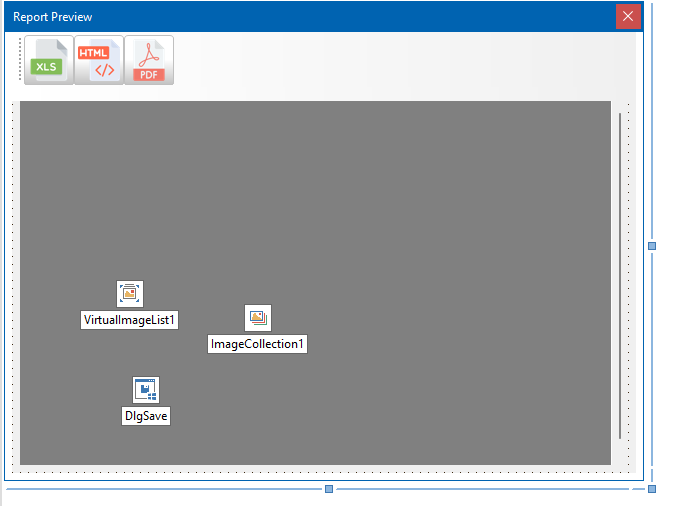

# Preview

The preview window will allow viewing the report. In addition, the end user will be able to export the report to different formats.



## Linking the report

```pascal
constructor TFrmPreview.Create(AModel: TDbModel);
begin
  inherited Create( nil );

  FModel := AModel;
  FManager := TReportManager.Create( nil, FModel.Connection );

  UpdateToolbar;

  FImgExport := nil;
end;
```

## Showing the form

```pascal
procedure TFrmPreview.ShowParticipants(ASalesId: Integer);
begin
  FManager.ReportParticipants(ASalesId);
  UpdateReport;
  UpdateToolbar;

  self.ShowModal;
end;
```

```pascal
procedure TFrmPreview.UpdateToolbar;
var
  LEnabled: Boolean;

begin
  LEnabled := FManager.LastReport <> nil;

  btnHtml.Enabled := LEnabled;
  btnPdf.Enabled := LEnabled;
  btnXls.Enabled := LEnabled;
end;
```
## Generating the preview

```pascal
procedure TFrmPreview.UpdateReport;
begin
  if Assigned( FManager.LastReport ) then
  begin
    FImgExport.Free;

    // create an image export as import for preview
    FImgExport := TFlexCelImgExport.Create( FManager.LastReport );

    // assign the image export
    Preview.Document := FImgExport;

    // update the window
    Preview.InvalidatePreview;
  end;
end;
```

## Export to HTML

```pascal
```

## Export to Microsoft Excel (*.xlsx)

```pascal
```


## Export to PDF

```pascal
procedure TFrmPreview.ExportPdf;
var
  LFileType: TFileTypeItem;
  LExport: TFlexCelPdfExport;

begin
  DlgSave.FileTypes.Clear;
  DlgSave.DefaultExtension := 'pdf';
  LFileType := DlgSave.FileTypes.Add;

  LFileType.DisplayName := 'Adobe Portable Document Format  (*.pdf)';
  LFileType.FileMask := '*.pdf';

  LExport := nil;

  if DlgSave.Execute then
  begin
    LExport := TFlexCelPdfExport.Create( FManager.LastReport );
    try
      LExport.Export( DlgSave.FileName );
    finally
      LExport.Free;
    end;
  end;
end;
```

