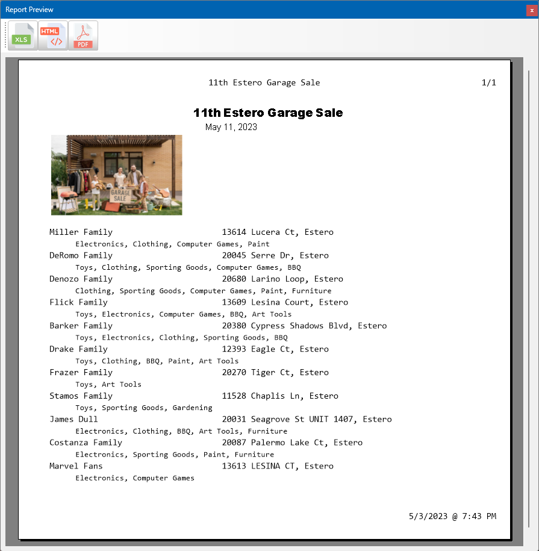

# TMS FlexCel: Reporting Everywhere

The session will explain how to create a database-driven report with preview. In order to provide reports to web clients, the report will be loosely coupled to the user interface and can thus be used inside of an XData server as well.

