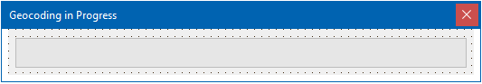

# Geocoding

Geocoding is the process of converting a textual address into geographic coordinates. These are expresses as latitude and longitude. 

## What's the main difficulty?

No matter which geocoding process offered by FNC Maps you use, it will always be an asynchronous process. That means you will have to trigger the process and then pickup the result at a different location in your code. Delphi offers two alternatives:

- **Events**: Implement an event that is triggered when the geocoding process has completed.
- **Closures**: An anonymous method or closure is added to the call to start the geocoding process. The closure is executed upon completion. 

This seems like no big deal as soon as you have mastered both concepts. However, in our specific use case we have to deal with multiple geocoding processes. To be precise: We have a dataset with a list of addresses and all these addresses are supposed to be converted into coordinates. If we trigger multiple geocoding processes how can we determine what participant a result we receive some time in the future belongs to? Further, the process is going to take a long time and we need to provide a user interface during the process without blocking the main thread.

In a nutshell, this will be the most difficult part of all my sessions of TMS Days 2023.

## Data model considerations

The table `SaleParticipant` does not contain any coordinates. Instead, another table called `Locations` contains `Latitude` and `Longitude` for a participant. Its `Id` is the same as the `Id` of the matching record in `SalesParticipant`.

>This implies that all records in `SalesParticipant` need to be geocoded that do not have a record in `Locations`.

## Geocoding records from a database

The whole geocoding process can be divided up into several parts. 

- Determine the participants in `SalesParticipant` that actually need location information.
- Count records and set up user interface with progress
- Trigger the process ("issue an request") for each record that needs location information
- Receive results and add records to `Location`
- Update user interface and close progress dialog when all request completed

### Getting relevant participants

Before we can begin, we need to determine the participants that are relevant. Instead of working with `TDataSet`, information is read into object instances.

#### Class model 

```pascal
TLocation = class
  private
    FLatitude,
    FLongitude: Double;
    FOnUpdateLocation: TNotifyEvent;

    FOwner: TObject;
  public
    constructor Create( AOwner: TObject );
    procedure UpdateLocation( ALatitude, ALongitude: Double );

    property Owner: TObject read FOwner;
    property Latitude: Double read FLatitude;
    property Longitude: Double read FLongitude;

    property OnUpdateLocation: TNotifyEvent
      read FOnUpdateLocation write FOnUpdateLocation;
  end;
```

The class `TLocation` is used to store the coordinates that the geocoding process determines. Each object instance will be linked to the participant it belongs to using the `Owner` property. You can also register to receive a notification  when a location changes using the `OnUpdateLocation` event.

```pascal
{ TLocation }

constructor TLocation.Create(AOwner: TObject);
begin
  FOnUpdateLocation := nil;
  FOwner := AOwner;
end;

procedure TLocation.UpdateLocation(ALatitude, ALongitude: Double);
begin
  FLatitude := ALatitude;
  FLongitude := ALongitude;

  if Assigned( FOnUpdateLocation ) then
  begin
    FOnUpdateLocation( self.Owner );
  end;
end;
```

Instead of using a participant-specific class, we use a class build to store a participant that needs a location.

```pascal
  TNeedLocation = class
  private
    FId: Integer;
    FAddress: String;
    FLocation: TLocation;

  public
    constructor Create( ADataset: TDataset );
    destructor Destroy; override;

    procedure TransferFrom( ADataset: TDataset );

    property Id: Integer read FId write FId;
    property Address: String read FAddress write FAddress;
    property Location: TLocation read FLocation;
  end;

  TNeedLocations = TObjectList<TNeedLocation>;
```

The class `TNeedLocation` will take all necessary information from a record of `SalesParticipant`. We remove the default constructor and add a custom constructor that takes a `TDataSet` as parameter. In the constructor, the current record of the dataset is assigned to the field values.

```pascal
{ TNeedLocation }

constructor TNeedLocation.Create( ADataset: TDataset );
begin
  FLocation := TLocation.Create(self);

  if Assigned( ADataset ) then
  begin
    TransferFrom(ADataset)
  end;
end;

destructor TNeedLocation.Destroy;
begin
  FLocation.Free;

  inherited;
end;

procedure TNeedLocation.TransferFrom(ADataset: TDataset);
begin
  self.Id := ADataset.FieldByName('Id').AsInteger;
  self.Address := ADataset.FieldByName('Address').AsString;
end;
```
#### Accessing the database

We use the query `NeedLocation` to determine all participants that lack a location.

```sql
SELECT 
    P.Id, CONCAT( Street, ",", City, ",", State, " ", Zip ) AS Address, 
    Latitude, Longitude FROM SalesParticipant P  
LEFT JOIN Locations L ON L.Id = P.Id
WHERE (SalesId = :SalesId) AND (Latitude IS NULL)
```
These records will be transferred into a list of `TNeedLocations`.

```pascal
function TDbModel.GetNeedLocations(ASalesId: Integer): TNeedLocations;
var
  LNeedLocation: TNeedLocation;
begin
  NeedLocation.Close;
  NeedLocation.ParamByName('SalesId').AsInteger := ASalesId;
  NeedLocation.Open;

  Result := TNeedLocations.Create;

  while not NeedLocation.Eof do
  begin
    LNeedLocation := TNeedLocation.Create( NeedLocation );
    LNeedLocation.Location.OnUpdateLocation := self.OnUpdateLocation;
    Result.Add( LNeedLocation );

    NeedLocation.Next;
  end;
end;
```
A **very* important line of code is very easy to miss in here. We define the `OnUpdateLocation` event and point it to the method `OnUpdateLocation` inside of the database model! 

```pascal
procedure TDbModel.OnUpdateLocation(Sender: TObject);
var
  LLocation: TNeedLocation;
  LQuery: TFDQuery;

begin
  LLocation := TNeedLocation( Sender );

  LQuery := UpdateLocation;
  TMonitor.Enter( LQuery );
  try
    LQuery.ParamByName('Id').AsInteger := LLocation.Id;
    LQuery.ParamByName('Latitude').AsFloat := LLocation.Location.Latitude;
    LQuery.ParamByName('Longitude').AsFloat := LLocation.Location.Longitude;
    LQuery.ExecSQL;
  finally
    TMonitor.Exit(LQuery);
  end;
end;
```
It is also not as simple as it seems to update the location in the database. As multiple requests could potentially finish processing at the same time, `OnUpdateLocation` might get called multiple times from different closures. We only have one query called `UpdateLocation` on the data module. We either change our approach and create one unique query instance with its own connection for each thread (this is what we do by default when using XData, for example), or we make sure that the database query is only touched by one thread at a time. With `TMonitor` we can make that happen using the `LQuery` itself as the token of the semaphore. We only enter the semaphore, when the monitor tied to `LQuery` is not locked. Entering the semaphore means setting the parameters of the query and executing it. Further, `TMonitor.Exit` is embedded in `finally` to make sure that the lock is opened no matter what. Otherwise, we would implement a deadlock. *I have warned you this was not going to be a walk in the park...*

Now, we are ready to look at the core of the geocoding functionality.

### Processing each record 

The following method iterates all participants and triggers one request for each of them. Let's focus on the main loop:

```pascal
    for var LNeedLocation in FNeedLocations do
    begin
      AGeoCoder.GetGeocoding( LNeedLocation.Address,
        // callback
        procedure(const ARequest: TTMSFNCGeocodingRequest; const ARequestResult: TTMSFNCCloudBaseRequestResult)
        var
          LItem: TNeedLocation;
        begin
          if ARequestResult.Success then
          begin
            LItem := TNeedLocation( ARequest.DataPointer );
            if ARequest.Items.Count > 0 then
            begin
              LItem.Location.UpdateLocation(
                ARequest.Items[0].Coordinate.Latitude,
                ARequest.Items[0].Coordinate.Longitude
              );
            end;
          end;

          TThread.Synchronize(
            nil,
            procedure
            begin
              FProgress.Increase;
            end
          );
        end, '', LNeedLocation
      );
    end;
```

1. We call `GetGeocoding` on the `TTMSFNCMapsGeocoding` component instance which is passed in as a parameter `AGeocoder`. This makes it possible to use this function loosely coupled from a form that contains this component, for example. The call is complex. I have to admit that. Especially as the closure *interrupts* the parameter listing. The last parameter of the call is `LNeedLocation`. That means we attach the object instance in the request. When the response is received we can determine the matching participant using this reference.
2. Instead of using events, a closure is used. 
    1. We check of the request was successful using `ARequestResult.Success`. Note that a successful request does not mean a location was found.
    1. As we passed the `TNeedLocation` instance as `DataPointer` we can retrieve it.
    1. Check if a location was found by counting the number of `Items`.
    1. If at least item was returned, update the location. This will trigger the event of `TLocation`!
3. Updating the user interface will happen inside of another closure which is passed to the main thread. `FProgress` is the reference to the progress dialog which will be explained in the next section. Just take it for granted that the methid `Increase` will increment the number of records that have been processed.

The full method looks like this:

```pascal
procedure TMainViewController.GeocodeParticipants(ASalesId: Integer; AGeocoder:
    TTMSFNCGeocoding);
begin
  if not Assigned( FGeocoder ) then
  begin
    FNeedLocations.Free;

    FGeocoder := AGeocoder;

    FNeedLocations := FModel.GetNeedLocations(ASalesId);

    FProgress.SetMax(FNeedLocations.Count);
    FProgress.Show;

    // main loop from above
  end;
end;
```
In addition to the main loop, the progress dialog is set up. All methods offered by the dialog allow access to a progress bar that is shown during the process. To make the code transparent and easy to read, the form offers `public` methods to communicate with the form instead of manipulating components from the outside.

## Creating a progress form

The progress form keeps the user in the loop about the progress of the geocoding progress. We are able to use a progress bar as we can determine the number of total requests easily. 



The form publishes two very simple methods to interact with the progress bar.

```pascal
type
  TFrmProgress = class(TForm)
    Bar: TProgressBar;
  private
    { Private declarations }
  public
    { Public declarations }

    procedure SetMax( AValue: Integer );
    procedure Increase;
  end;
```

`SetMax` sets the maximum value and also initializes the `Position` property.

```pascal
procedure TFrmProgress.SetMax(AValue: Integer);
begin
  Bar.Position := 0;
  Bar.Max := AValue;
  Bar.Min := 0;

  Application.ProcessMessages;
end;
```
`Increase` increments `Position`, but, in addition, also closes the form as soon as the maximum has been reached.

```pascal
procedure TFrmProgress.Increase;
begin
  Bar.Position := Bar.Position + 1;

  if Bar.Position = Bar.Max then
  begin
    self.Close;
  end;

  Application.ProcessMessages;
end;
```

Looking back the geocoding process, it calls both methods to initialize and update the progress bar. 