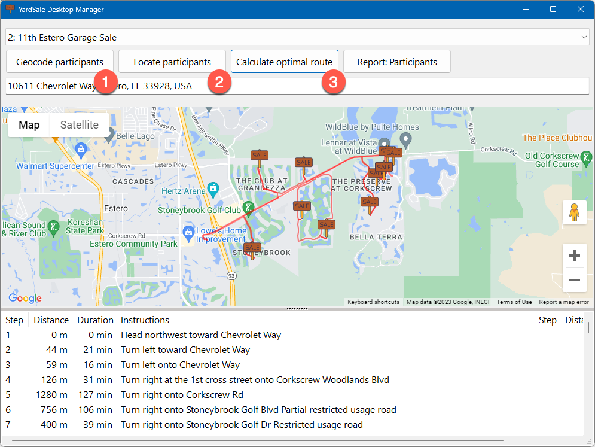
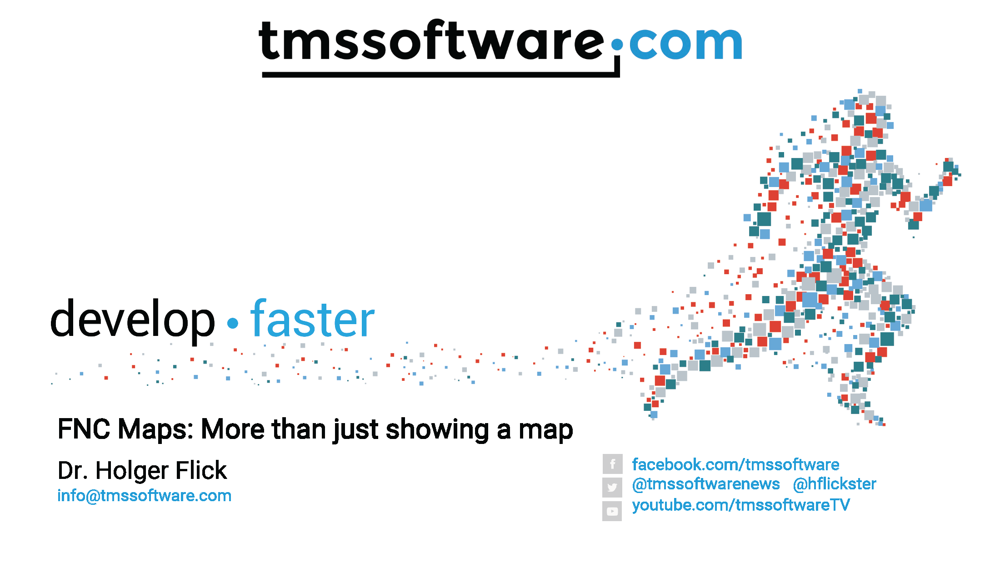
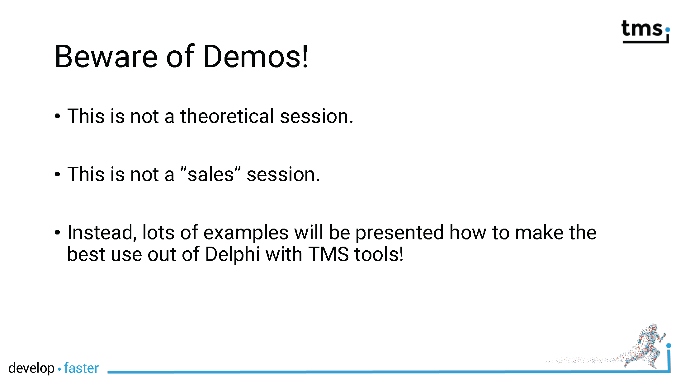
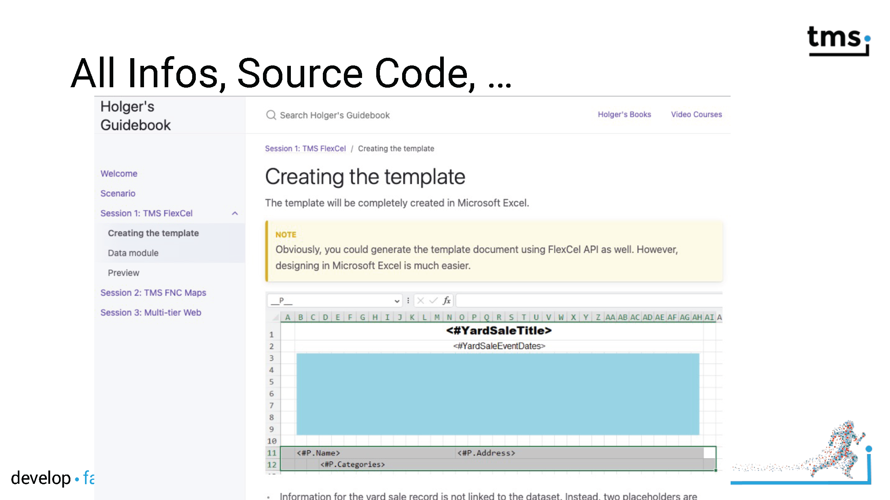
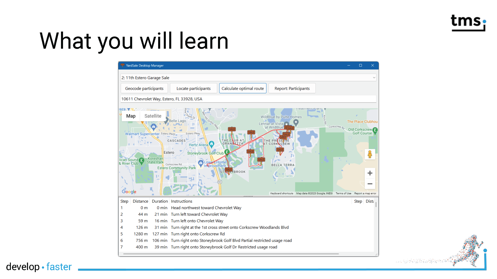
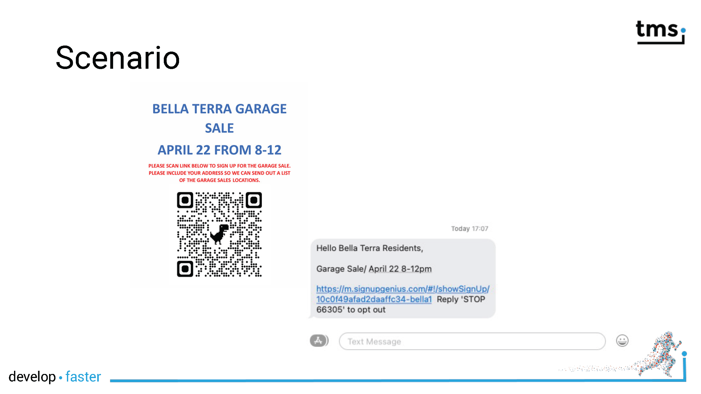
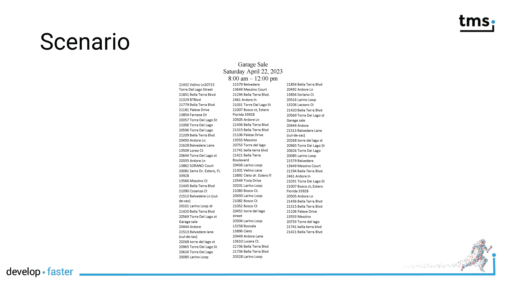
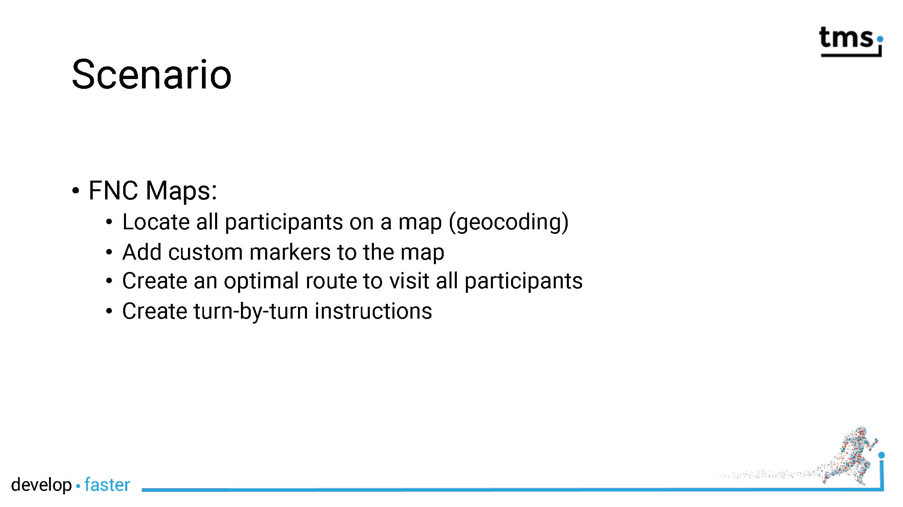
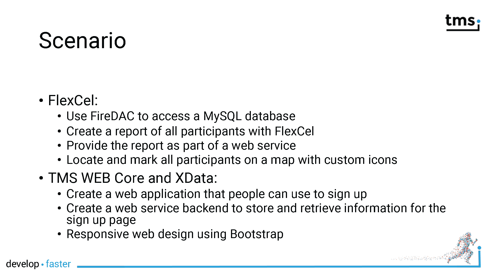
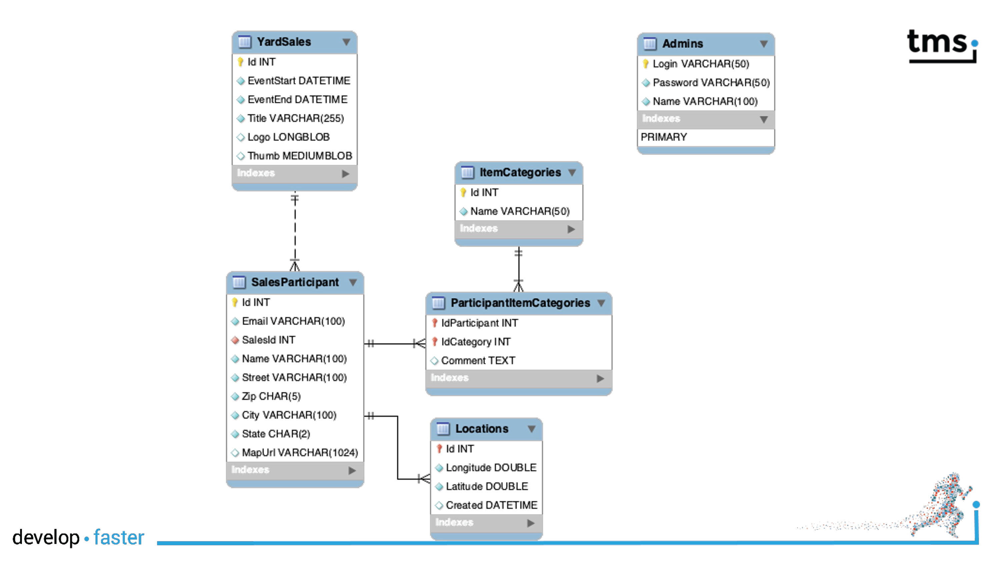

# TMS FNC Maps: Mapping database data

'Why do we need maps in an application that deals with yard sales?' you might ask. FNC Maps -- and I remember my promise not to present any sales pitch -- is much more than just displaying maps on a form. Actually, you get location and routing (direction) services in the package as well. 

In our scenario, the organizers want to provide a map in addition to the report of all participants so that you can find them quickly. Participants will be marked with a custom marker. Further, the organizer wants to visit all participants in an efficient way. Also, the directions should be clear and in human readable form how to visit all participants.

FNC Maps delivers all these features and you will learn them all.

1. Participants specify an address. You might need their geographical coordinate for other services like marking them on a map. Geocoding is the solution to convert a textual address into coordinates (latitude and longitude).
1. All participants will be marked on the map with a custom marker. The map view will also focus and zoom in on all parties.
1. An optimal route will be presented to visit all participants from a fictitious office as starting point which address is provided as well. Turn-by-turn instructions will be provided.

## Slides

- [PDF](../slides/Maps/FNC_Maps.pdf)
- [PowerPoint](../slides/Maps/FNC_Maps.pptx)

