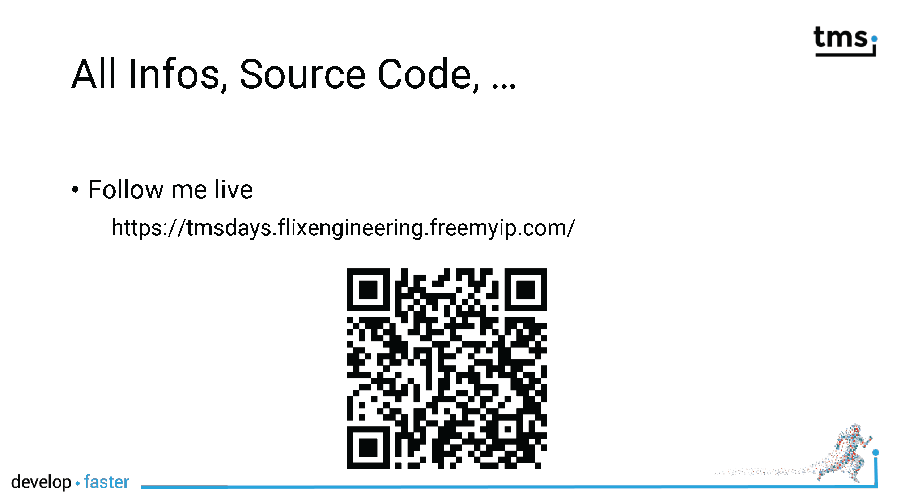

# TMS FNC Maps: Mapping database data

'Why do we need maps in an application that deals with yard sales?' you might ask. FNC Maps -- and I remember my promise not to present any sales pitch -- is much more than just displaying maps on a form. Actually, you get location and routing (direction) services in the package as well. 

In our scenario, the organizers want to provide a map in addition to the report of all participants so that you can find them quickly. Participants will be marked with a custom marker. Further, the organizer wants to visit all participants in an efficient way. Also, the directions should be clear and in human readable form how to visit all participants.

FNC Maps delivers all these features and you will learn them all. We will use Google Maps in all the examples. Most services are available for other mapping services as well.


1. Participants specify an address. You might need their geographical coordinate for other services like marking them on a map. Geocoding is the solution to convert a textual address into coordinates (latitude and longitude).
1. All participants will be marked on the map with a custom marker. The map view will also focus and zoom in on all parties.
1. An optimal route will be presented to visit all participants from a fictitious office as starting point which address is provided as well. Turn-by-turn instructions will be provided.

## Google API key

In order to run any of the examples, you will need to request a Google API key. Please have a look at the product documentation, the TMS web site, or my FNC Maps Hands-on Book (2) how to request and maintain them. It is of utmost importance that you keep these keys secret and restrict their usage.

In order not having to bundle the source code of the examples with an API key, the key has to be stored in the file named `GoogleApiKey.txt` in the sub-directory `resources` of the application. It will be linked into the executable when you compile the application. If you forget to create this file, a compiler error will be shown.

The class `TApiKeyLoader` is responsible to load the API key from the resource.

```pascal
{ TApiKeyLoader }

class function TApiKeyLoader.GoogleApiKey: String;
var
  LResourceStr: TResourceStream;
  LStringStr: TStringStream;

begin
  LStringStr := nil;
  LResourceStr := TResourceStream.Create( HInstance, 'APIKEY', RT_RCDATA );
  try
    LStringStr := TStringStream.Create;
    LStringStr.CopyFrom( LResourceStr );
    Result := LStringStr.DataString;
  finally
    LResourceStr.Free;
    LStringStr.Free;
  end;
end;
```

The method `TApiKeyLoader.GoogleApiKey` is invoked in several places to assign the API key to the FNC Maps controls. The magic behind the scenes happens in the file called `Resources.rc`. If you had a look at the FlexCel session, this file is also used to include the FlexCel report template as a resource. Make sure you encode it as ANSI as Unicode is not supported for resource files.

```
APIKEY RCDATA ".\resources\googleapikey.txt"
```
## Slides


- [PDF](../slides/Maps/FNC_Maps.pdf)
- [PowerPoint](../slides/Maps/FNC_Maps.pptx)





