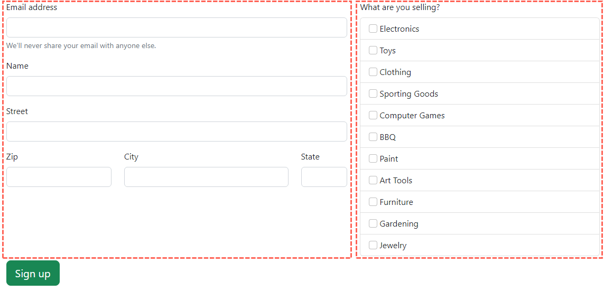
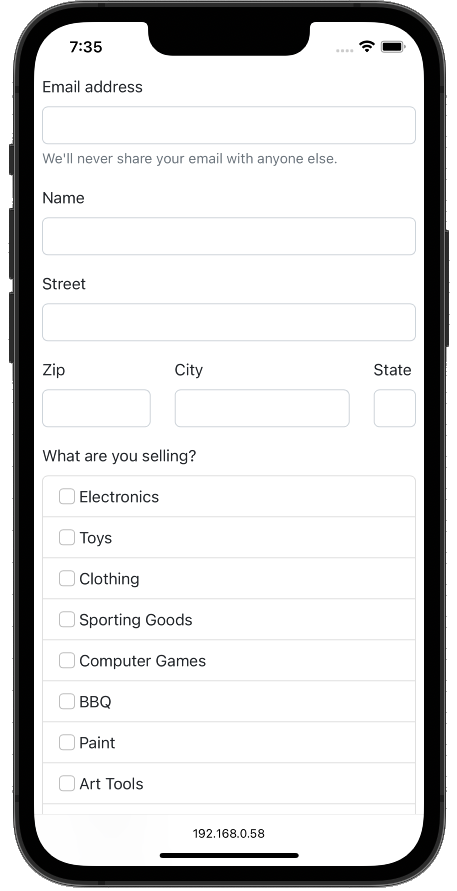
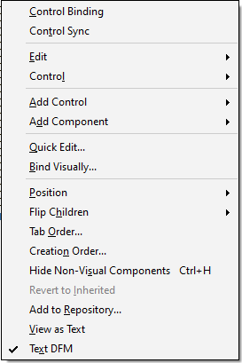
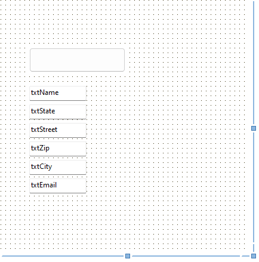

# Web Design

TMS WEB Core offers multiple approaches to build your web design:

- **Component-based**: Use the form designer and drop controls onto the form. Zero HTML. Zero CSS. A good first step when coming from Delphi.
- **Components with CSS classed**: Still focused on components, but CSS classes from popular frameworks are used to get the look and feel of modern web applications.
- **HTML layout linked to controls**: The focus flips on HTML and CSS for design. You no longer use controls as your primary source for layout. Controls are the link to the source code but serve no design purpose. Even the location on the form does not matter. HTML and CSS take full control. Only for users that have taken their first steps in TMS WEB Core already.

## HTML layout to add a participant

The main form of the example application is completely built in HTML. The HTML layout is found in the form unit, but it carries the extention `.html`. Let's have a look at it first and go from there. We have to start somewhere after all.

```html
<html>
  <body>
  <body>
    <div class="container p-2" id="container-lg">
      <div class="card text-center col-lg-7 offset-lg-3 mb-3">
        
        <div class="card-body">
          <div class="card-title display-5" id="YardSaleTitle"></div>
          <div class="card-subtitle fw-lighter" id="YardSaleDates"></div>
        </div>
      </div>
      <form>
        <div class="row">
          <div class="col-lg-7">
            <div class="mb-3">
                <label for="txtEmail" class="form-label">Email address</label>
                <input type="email" class="form-control" id="txtEmail" />
                <div id="emailHelp" class="form-text">
                  We'll never share your email with anyone else.
                </div>
              </div>
            <div class="mb-3">
              <label for="txtName" class="form-label">Name</label>
              <input type="text" class="form-control" id="txtName" />
            </div>
            <div class="mb-3">
              <label for="txtStreet" class="form-label">Street</label>
              <input type="text" class="form-control" id="txtStreet" />
            </div>
            <div class="row">
              <div class="col-4 mb-3">
                <label for="txtZip" class="form-label">Zip</label>
                <input type="text" maxlength="5" class="form-control" id="txtZip" />
              </div>
              <div class="col-6 mb-3">
                <label for="txtCity" class="form-label">City</label>
                <input type="text" class="form-control" id="txtCity" />
              </div>
              <div class="col-2 mb-3">
                <label for="txtState" class="form-label">State</label>
                <input type="text" class="form-control text-uppercase" maxlength="2" id="txtState" />
              </div>
            </div>
          </div>
          <div class="col-lg-5">
            <label class="form-label">What are you selling?</label>
            <ul id="ListItemCategories">
            </ul>
          </div>
        </div>
      </form>
      <button class="btn btn-lg btn-success my-2" id="btnSend">Sign up</button>
    </div>
  </body>
</html>
```

The layout makes heavy use of [Bootstrap](https://getbootstrap.com/docs/5.3/getting-started/introduction/) classes. The Bootstrap grid model is used to provide a responsive web layout. 



The two main columns of the design a the form (left) and the list of categories (right).

The form will allow the participant to enter their contact information. The list of categories can be used to check the items that are sold.

On a mobile device, however, the form cannot be shown side-by-side. That's what Bootstrap does automatically for us if we use the so called [media breakpoints](https://getbootstrap.com/docs/5.3/layout/breakpoints/).

The key to this are the following two definitions found in the layout. By default, each row in a Bootstrap grid has 12 columns. You can reserve any number of columns as "one column" inside those 12 columns. In this example, 7 columns are used for the form and the remaining 5 for the categories. In addition, the media breakpoint will tell the web browser when to stack those two columns.

1. `<div class="col-lg-7">` will use 7 of the 12 columns. As soon as the device used has a browser window width that is smaller than 992 pixels, the two columns will be stacked. 
1. <div class="col-lg-5"> uses the remaining 5 columns with the same media breakpoint.

Looking at the form on an iPhone 14, we see this happen:



As a Delphi developer the work we have to do is zero. This all happens in the browser delegated by the HTML and CSS used. As developers, we can focus on the business logic. A professional web developer will build the form shown here within a few minutes. Most likely, they will start working of a template they already have ready to go.

The form itself is not spectacular. When I created this web application, I started with the example given in the Bootstrap documentation  and kept adding to it.

## Adding Bootstrap to the application

In order to use Bootstrap, I needed to add the Bootstrap libraries to the `index.html` file. Al

## Generating controls

If you were to run a TMS WEB Core application at this point, the form would appear and you would be able to enter information into it. You would even be able to click on the button. Nothing would happen though. The reason is that the HTML controls are not TMS WEB Core control. We need to either drop (compatible) TMS WEB Core controls onto the form designer or let RAD Studio help us.



_Control Sync_ will assist us in creating all the controls on the form. Only controls that have an `ID` assigned will be carried over. This way we are now able to access the controls.

TMS WEB Core also contains a pre-defined list of mappings which TMS WEB Core control is created for a specific HTML control. In this case, each `<INPUT>` control creates a `TWebEdit` control. The button `<BUTTON>` will be represented by an instance of `TWebButton`.

{: .note}
This process offers a great amount of customization. Refer to the product documentation or my book for a detailed explanations of all the various options.

At the end, we will end up with a form with the following components:



Again, their location on the form is completely irrelevant. TMS WEB Core is "out of the loop", HTML and CSS are in control when it comes to design. We can, however, write code that accesses the button, for example. Also, we can implement events for any control. The controls are linked to the HTML controls on the form and we can easily interact with them and add code to them. The big difference from writing a web application in JavaScript is now that we can use Object Pascal which is type-safe and we do not have to use JavaScript. 

{: .note}
This also means that your legacy Delphi code can very easily included in TMS WEB Core web applications.

## Where are the categories?

If you had a close look at the HTML above, you might notice that the categories are nowhere to be found. Instead, you only find a snippet that hints at them:

```html
<label class="form-label">What are you selling?</label>
<ul id="ListItemCategories">
</ul>
```

If you know a bit HTML, this points to a definition of a label followed by an unordered list. The list does not have any elements though because they would be listed using `<LI>` tags.

The question remains where the categories are generated. You might be able to guess as Delphi's strong suit have always been database operations. TMS WEB Core is no different. Still, in this case, I simply chose to add the `<LI>` elements using code. 

TMS WEB Core gives us access to the DOM of the web browser. Thus, we can interact with all the elements in an HTML document using objects. That is a very important fact as we are not just tinkering with Strings. Type-safety during the whole process will be there and the code will remain very much manageable and readable.

{: .note}
For this session, I cannot go into the depth of dynamic page creation and only present the example. You know where to find step-by-step examples with detailed explanations by now.

Imagine you have a list of object instantiated from the following class:

```pascal
type
  TBsWebCheckListBoxSelection = ( Multiple, One );

  TBsWebCheckListBoxItem = class
  private
    FText: String;
    FId: String;
    FElement: TJSElement;

  public
    property Id: String read FId write FId;
    property Text: String read FText write FText;

    property Element: TJSElement read FElement write FElement;
  end;
```
Each item has a `Text` and a unique `Id` for identification. Further, as soon as we add it to the DOM, we remember its `Element`.

I wrote a helper class in the application, that generates a list with check boxes of a list of this type. At first, it might look menacing, but we will pick it apart and light will be at the end of the tunnel for certain. In order to make it easier to understand, it always helps to write down the HTML code that needs to be generated for something to look a certain way first:

```html
<ul id="ListItemCategories" class="list-group">
  <li class="list-group-item">
    <input class="form-check-input me-1" type="checkbox" name="radiogroup-180" ref="2" id="chkItemCategories2">
    <label class="form-check-label" for="chkItemCategories2">Electronics</label>
  </li>
  ...
</ul>
```

The entry point into the document is the element `ListItemCategories`. To this element, we need to add as many `<LI>` tags as there are categories.

Each of these tags then is customized as the Bootstrap documentation requires it. Inside of each `<LI>` tag, we need an `<INPUT>` tag for the checkbox and `<LABEL>` for the description.

As we can use Object Pascal, a loop over the categories comes to mind to achieve this.

```pascal
procedure TBsWebCheckListBox.Update;
var
  LLabel,
  LLi: TJSElement;
  LInput: TJSHTMLInputElement;
  LId: String;
  i: Integer;
  LItem: TBsWebCheckListBoxItem;
  LRandomName: String;

begin
  if Assigned( FElement ) then
  begin
    FElement.className := 'list-group';
    FElement.innerHTML := '';

    LRandomName := 'radiogroup-' + IntToStr( RANDOM(9999) );

    for i := 0 to FItems.Count-1 do
    begin
      LItem := FItems[i];

      LLi := document.createElement('li');
      LLi.className := 'list-group-item';
      FElement.appendChild(LLi);

      LInput := document.createElement('input') as TJSHTMLInputElement;
      LItem.Element := LInput;

      LInput.className := 'form-check-input me-1';
      LInput.value := '';
      LInput._type := TypeForSelection( Selection );

      LInput.name := LRandomName;
      LInput['ref'] := LItem.Id;

      LId := 'chkItemCategories' + LItem.Id;
      LInput.id := LId;

      LLabel := document.createElement('label');
      LLabel.className := 'form-check-label';
      LLabel['for'] := LId;
      LLabel.innerText := LItem.Text;

      LLi.appendChild( LInput );
      LLi.appendChild( LLabel );
    end;
  end;
end;
```
The list of items is stored in the field variable `FItems`. That list is being iterated an each element is being extracted. Then, we create the HTML elements as explained in the last paragraph using the classes `TJSElement` and `TJSHTMLInputElement`. The properties of the classes match their HTML or JavaScript counterparts. To repeat this important fact, the compiler will be able to check that we create the elements correctly. Errors in our design will show up before run-time.

The final question is now, of course: Where does the list of categories come from? And that is where the web service comes into play.

Not only does the web service provide information about the yard sale on the top of the page that you might sign up for, but it also supplies the list of categories.

That's the next part of the session how to consume information from a web service using TMS WEB Core.
