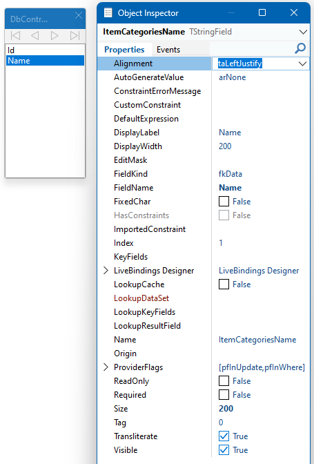

# Web Service: Client

In order to connect to the web service, we use XData components that are available in TMS WEB Core. Compared to generic web services that gives us an efficient approach. We only have to specify the base URL of the XData server and all the service URLs are generated for us. We only need to know the names of the operations. As trivial as it may sound, but this is a huge time saver. It also prevents us from making common mistakes when it comes to encoding request URLs, headers, and bodies.

## Connecting to web services

Connecting to the web service is possible setting the `Connected` property of the `TXDataWebConnection` to `True`. 

```pascal
procedure TDbController.Connect;
begin
  Connection.Connected := True;
end;

procedure TDbController.ConnectionError(Error: TXDataWebConnectionError);
begin
  if Assigned( FOnConnectionError ) then
  begin
    FOnConnectionError( Error );
  end;
end;
```

Remember that this is an asynchronous process and as we do not want to wait for it to complete, we will implement the next step in the `OnConnect` event which is called when the connection has been established. Also, in case there is an error, we call the event of the `TDbController` event `OnConnectionError`. Yes, the data module that is part of this application offers its own events that a form or any other object can subscribe to.

```pascal
procedure TDbController.ConnectionConnect(Sender: TObject);
begin
  RequestItemCategories;
end;
```
## Requesting the categories

As soon as the connection is established, the categories will be requested from the web service. This is implemented in the method `RequestItemCategories`.

```pascal
procedure TDbController.RequestItemCategories;
var
  LResponse: TXDataClientResponse;

begin
  try
    LResponse := await(
      Client.RawInvokeAsync('IYardSaleService.ItemCategories', [ 'soUsage' ] )
      );

    if LResponse.StatusCode = 200 then
    begin
      AssignItemCategories( LResponse );
    end;
  except
    on E: EXDataClientException do
    begin
      // handle error
      console.log( E.Message );
    end;
  end;
end;
```

Above you see an exemplary call to the web service using `RawInvokeAsync`. We also pass a parameter to indicate the sort order that we desire. The parameter is of type enum and XData allows us to specify a String instead of declaring an enum.

```pascal
type
  TItemCategorySortOrder = (soName, soUsage);
```

`soName` orders the categories alphabetically whereas `soUsage` orders them by their usage. That means, the more an item is being chosen by other participants the further up the list it moves.

A successful response will be passed to `AssignItemCategories`.

```pascal
procedure TDbController.AssignItemCategories(AResponse: TXDataClientResponse);
begin
  ItemCategories.Close;
  ItemCategories.Rows := TJSArray( AResponse.ResultAsObject['value'] );
  ItemCategories.Open;

  if Assigned( FOnUpdateItemCategories ) then
  begin
    FOnUpdateItemCategories(ItemCategories);
  end;
end;
```

We make use of a feature that you will not find in the documentation of either XData or TMS WEB Core. It's very useful though. Each `TWebClientDataSet` has a property called `Rows`. To this property, you may assign an array of type `TJSArray`. 

Let's look at the result from the web service:

```json
{
    "value": [
        {
            "Name": "Electronics",
            "Id": 2
        },
        {
            "Name": "Toys",
            "Id": 1
        },        
    ]
}
```

The returned document consists of an object with one property value `value`. This property contains an array of all categories which is exactly the data we are interested in. That's the array we can assign to `Rows`. This will not work without one more step. The dataset needs a list of all the fields it is supposed to map from `Rows`. Thus, either at design-time or run-time set the fields of the `TWebClientDataSet` so that they match their JSON counterparts. JSON is case sensitive, so you need to pay attention how each field is named which is usually not necessary when writing Delphi code.



We can chose exactly the same approach for the yard sale information.

## Requesting yard sale information

On the top of the page, we want to display information about the yard sale the people subscribe to. I have neglected this part a bit in the HTML layout part, but there is an interesting tidbit to remember when it comes to a single item. We have just learned how to use `Rows` of `TWebClientDataSet` to read multiple JSON objects into it. In this case, there will be only on object returned:

```json
{
    "Id": 2,
    "EventStart": "2023-05-11T13:00",
    "EventEnd": "2023-05-11T19:00",
    "Logo": "/9j/4AAQSkZJRgABAQAAAQABAAD/2wBDAAMCAgMCAgMDAwMEAwMEBQgFBQQEBQoHBwYIDAoMDAsKCwsNDhIQDQ4RDgsLEBYQERMUFRUVDA8XGBYUGBIUFRT/2wBDAQMEBAUEBQkFBQkUDQsNFBQUFBQUFBQUFBQUFBQUFBQUFBQUFBQUFBQUFBQUFBQUFBQUFBQUFBQUFBQUFBQUFBT/wAARCAJYA4QDASIAAhEBAxEB/8QAHwAAAQUBAQEBAQEAAAAAAAAAAAECAwQFBgcICQoL/ZkvEWRkjwwUmrWnwxPBDCAAAAAAAAAAAAAAAAAAAAAAAAAAAAAAAAAAAAAAAAAAAAAAAAAAAAAAAAAAAAAAAAAAAAAAAAAAAAAAAAAAAAAAAAAAAAAAAAAAAAAAAAAA==",
    "Title": "11th Estero Garage Sale",
    "EventStartEpoch": 1683810000,
    "EventEndEpoch": 1683831600
}
```
I cut off most of the `Logo` property. It contains a thumbnail image for the yard sale in Base64 encoding. Still, we immediately see that there is no array to be found which is needed to assign it to the `Rows` property. 

```pascal
procedure TDbController.RequestYardSaleDetails(ASaleId: Integer);
var
  LResponse: TXDataClientResponse;

begin
  try
    LResponse := await(
      Client.RawInvokeAsync('IYardSaleService.GetYardSale', [ ASaleId ] )
      );

    if LResponse.StatusCode = 200 then
    begin
      ProcessYardSaleDetails( LResponse );
    end;
  except
    on E: EXDataClientException do
    begin
      // handle error
      console.log( E.Message );
    end;
  end;
end;
```

Let's start exactly with the same boilerplate code as before. A successful response calls `ProcessYardSaleDetails`.

```pascal
procedure TDbController.ProcessYardSaleDetails(AResponse: TXDataClientResponse);
var
  LObj: TJSObject;

begin
  LObj := AResponse.ResultAsObject;
  FDetails.Free;
  FDetails := TYardSaleDetails.Create;
  FDetails.Title := JS.toString( LObj['Title'] );
  FDetails.EventStart :=
    TTimeZone.Local.ToLocalTime(
      TBclUtils.ISOToDateTime(
      JS.toString( LObj['EventStart'] ) )
    );
  FDetails.EventEnd :=
    TTimeZone.Local.ToLocalTime(
      TBclUtils.ISOToDateTime(
      JS.toString( LObj['EventEnd'] ) )
    );
  FDetails.LogoDataUrl := 'data:image/jpeg;base64,' +
    JS.toString( LObj['Logo'] );

  if Assigned( FOnUpdateYardSaleDetails ) then
  begin
    FOnUpdateYardSaleDetails( FDetails );
  end;
end;
```
Instead of using `TWebClientDataSet`, we read each JSON property value manually. If you want to use a dataset, simply construct a new `TJSArray` instance and pass the object in the constructor. This will create an array with one element which can then be mapped to the dataset as its only records. The setup for this is more than is needed in my opinion though and this approach is much better. Especially, as we need to convert the date/time values to local time and also need to convert them from `String` to `TDateTime`.

## Sending form data

XData will make it easier to send data to the web service yet again than working with generic ones. We do not have to care about encoding and any sort of URL encoding. Instead, we can pass an object as parameter which we will fill with the parameters the backend requires. Getting a bit ahead of myself, I need to show you the fingerprint of the service method that will accept new participants:

```pascal
procedure AddParticipant( NewParticipant: TNewParticipant );
```
As there is no additional custom attribute in the XData service method defintion, we can deduct we need to send a `POST` request. XData will do this automatically, but it means XData will also encode an instance of `TNewParticiant` in the body. Thus, on the client side, we need to create a `TJSObject` instance matching its properties. 

{: .warning}
The class inheritance is not helpful to make this example easier to understand. However, this is a real use case and in order to have am example for using inheritance this will be great to learn from. Obviously, you will have to study the code after listening to the presentation to fully grasp the concept.

```pascal
  TItemCategory = class
  private
    FName: String;
    FId: Integer;
  public
    property Id: Integer read FId write FId;
    property Name: String read FName write FName;
  end;

  TItemCategories = TObjectList<TItemCategory>;

  TParticipantCategory = class(TItemCategory)
  private

    FComment: String;
  public
    property Comment: String read FComment write FComment;
  end;

  TParticipantCategories = TObjectList<TParticipantCategory>;

  TParticipantCore = class
  private
    FName: String;
    FStreet: String;
    FState: String;
    FZip: String;
    FCity: String;

  public
    property Name: String read FName write FName;
    property Street: String read FStreet write FStreet;
    property Zip: String read FZip write FZip;
    property City: String read FCity write FCity;
    property State: String read FState write FState;
  end;

  TUpdateParticipant = class
  private
    FParticipant: TParticipantCore;
    FCategories: TParticipantCategories;
  public
    constructor Create;
    destructor Destroy; override;

    property Participant: TParticipantCore read FParticipant write FParticipant;
    property Categories: TParticipantCategories read FCategories write FCategories;
  end;

  TNewParticipant = class( TUpdateParticipant )
  private
    FEmail: String;
    FSaleId: Integer;

  public
    property SaleId: Integer read FSaleId write FSaleId;
    property Email: String read FEmail write FEmail;
  end;
```
As the object is rather complex, I hid all that code in `AsJsObject`. The property will return the information stored in the object as an instance of `TJSObject`. 

```pascal
procedure TDbController.SendNewParticipant(ANewParticipant: TNewParticipant);
var
  LResp: TXDataClientResponse;
  LObj: TJsObject;

begin
  LObj := ANewParticipant.AsJsObject;
  try
    LResp := await( Client.RawInvokeAsync( 'IYardSaleService.AddParticipant', [LObj] ) );

    if LResp.StatusCode = 204 then
    begin
      if Assigned( FOnSendNewParticipantSuccess ) then
      begin
        FOnSendNewParticipantSuccess( LResp );
      end;
    end;
  except
    on E: EXDataClientException do
    begin
      if Assigned( FOnSendNewParticipantFail ) then
      begin
        FOnSendNewParticipantFail( LResp );
      end;
    end;

  end;
end;
```
That's "_how they get you_". It looks so simple, but `AsJsObject` hides a lot of code. Also, one class uses sub-properties with other classes that have their own `AsJsObject` property. For now, I think you agree me that just accepting "we get a `TJSObject` an pass it to the web service" does suffice as a first step. 

```pascal
function TUpdateParticipant.GetAsJSObject: TJSObject;
var
  c: Integer;
  LArray: TJSArray;
begin
  Result := TJSObject.new;
  Result['Participant'] := self.Participant.AsJSObject;

  LArray := TJSArray.new( self.Categories.Count );
  for c := 0 to self.Categories.Count-1 do
  begin
    LArray[c] := self.Categories[c].AsJsObject;
  end;

  Result['Categories'] := LArray;
end;

{ TParticipantCore }

function TParticipantCore.GetAsJSObject: TJSObject;
begin
  Result := TJSObject.new;

  Result['Name'] := self.Name;
  Result['Street'] := self.Street;
  Result['Zip'] := self.Zip;
  Result['City'] := self.City;
  Result['State'] := self.State;
end;

{ TItemCategory }

function TItemCategory.GetAsJsObject: TJsObject;
begin
  Result := TJSObject.new;

  Result['Id'] := self.Id;
  Result['Name'] := self.Name;
end;

{ TNewParticipant }

function TNewParticipant.GetAsJSObject: TJSObject;
begin
  Result := inherited;

  Result['Email'] := self.Email;
  Result['SaleId'] := self.SaleId;
end;
```

How to convert your actual object instance to `TJSObject` is something you will need to do once, but understanding all the other parts of the application is much more important at this stage.